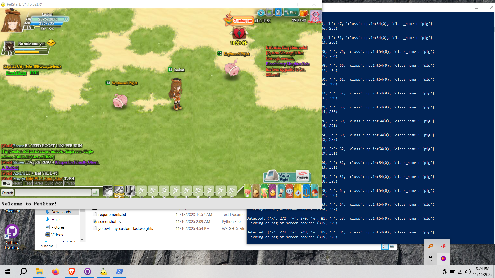

 ## NOTES  
 - uv venv for manage dependencies
 ```
 .venv\Scripts\activate    
 ```
 - run it
 ```
 python .\FINAL-RUN-WITH-ADMIN.py  
 ```
 fork it from this, so it works with pet star
 ```
 github.com/moises-dias/yolo-opencv-detector
 ```
 
