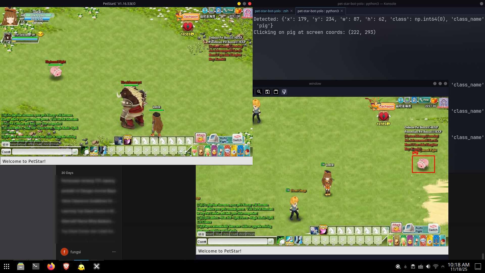

 ## NOTES  
 - uv venv for manage dependencies
 ```
 uv pip install opencv-python pillow pyautogui
 ```
 - for system
```
 sudo apt-get install python3-tk python3-dev
```
 ```
 .venv\Scripts\activate    
 ```
 - run it
 ```
 python .\FINAL-RUN-WITH-ADMIN.py  
 ```
 fork it from this, so it works with pet star
 ```
 github.com/moises-dias/yolo-opencv-detector
 ```



